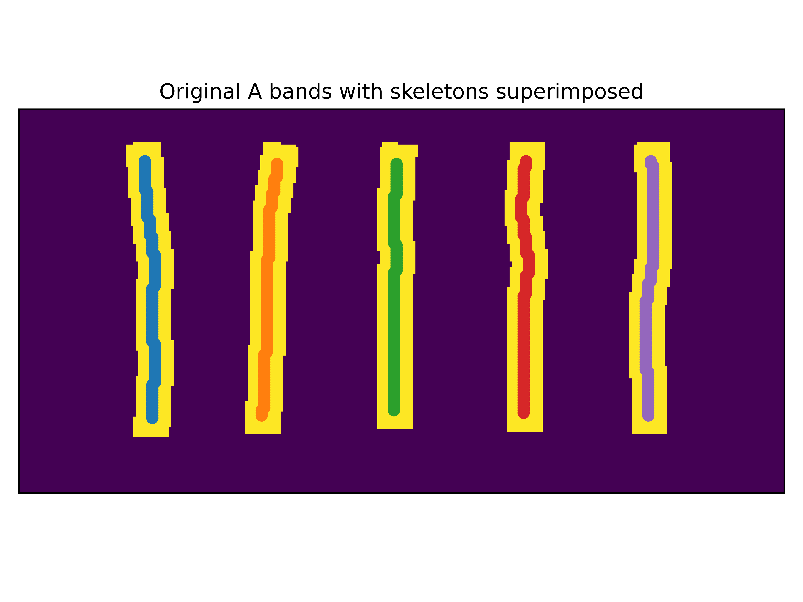
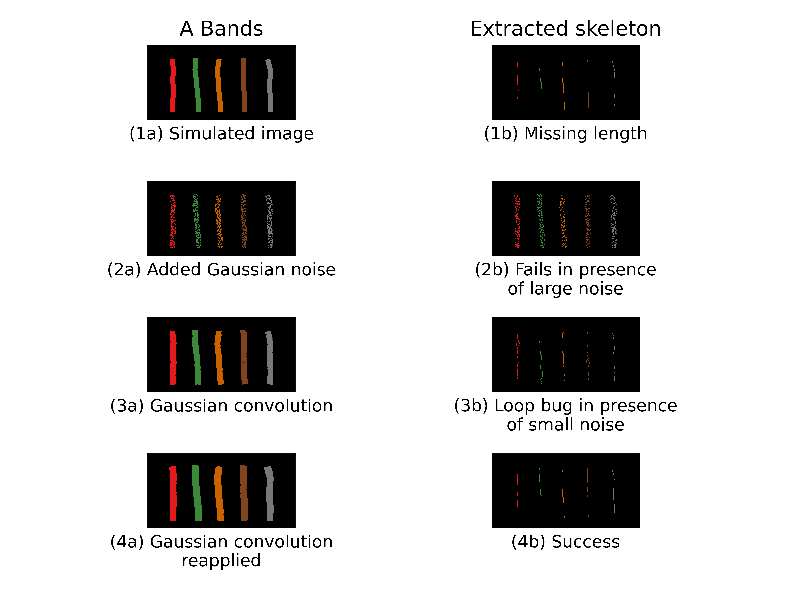
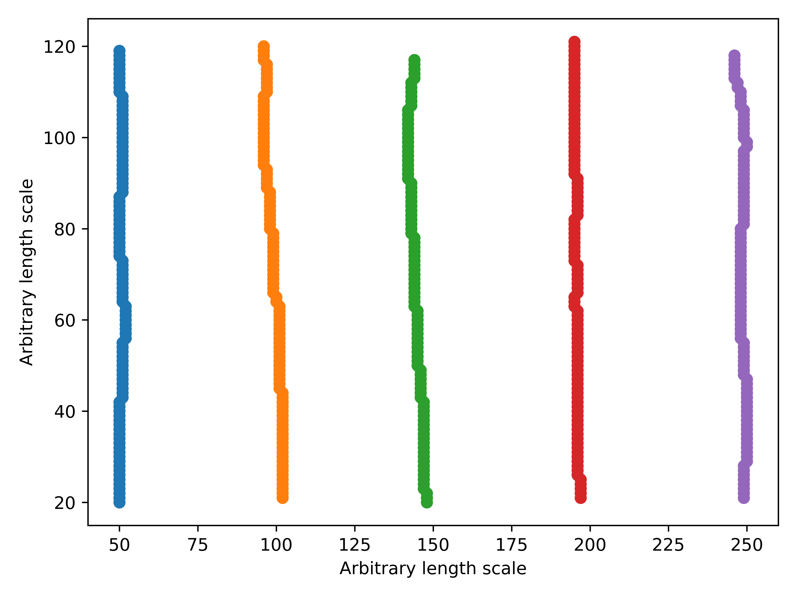

# MyoBand
Simulation and analysis of A bands in myofibril imaging 
written in `Python`.

> Note: if the text in the images is unreadable due to 
dark mode, please open them in a new tab.

[MyoBand in the Python repository](https://pypi.org/project/MyoBand)

## Simulation
Run `python3 simulation.py` to simulate A bands.

## Analysis
Get the skeletons of the A bands by running `python3 get_skeletons.py -d DATA_LOCATION`

## Installation
- Install with `pip install myoband`
- Clone this repo in order to use examples

## Details
- For A band creation see `A_band.py` in tests folder.
- An A band is created by adding thickness to 
a polynomial. The polynomial is created 
using a random walk (see `randomwalk.py`).
- A Slide is a 2D array of zeros. `A_Bands` are then 
added, forming a mask array. 
The slide can be viewed using `myoband.plotting.imshow(example_slide)`.
- Gaussian noise can be added and removed (see `skeleton_example.py`, in which the robustness of the programme is benchmarked).

- Contours of the A bands can be extracted. This feature is used to extract the separate A bands from the image slide.

- Run `get_skeletons.py` to extract (a) a mask representation of the skeletons and (b) a list of points of the skeletons.

Copyright, 23 March 2023, Henry Joseph Sheehy. All rights reserved.
